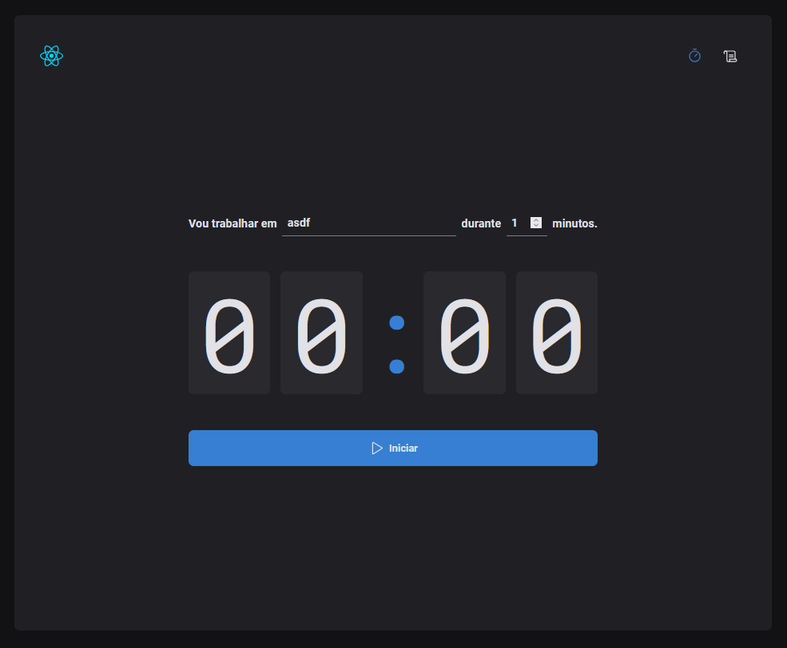

# POMODORO TIMER

O "POMODORO TIMER" é um aplicativo que ajuda você a gerenciar suas tarefas e tempos de trabalho. 

## Funcionalidades

- Cronômetro de Contagem Regressiva Funcional: O aplicativo conta com um cronômetro que segue a técnica Pomodoro, ajudando a dividir o tempo em intervalos de trabalho e descanso.
- Função de Pausa: Permite pausar o cronômetro a qualquer momento e retomar de onde parou, proporcionando maior flexibilidade no gerenciamento de tarefas.
- Lista de Tarefas: Organize suas atividades, e gerencie os tempos de trabalho com facilidade.

## Demonstração

### Home


### Lista de Tarefas


## Bibliotecas

- React
- Styled Components
- TypeScript
- Hooks
- Zod
- React Hook Form
- Date-fns

## Como executar

```bash
npm install
npm start
```