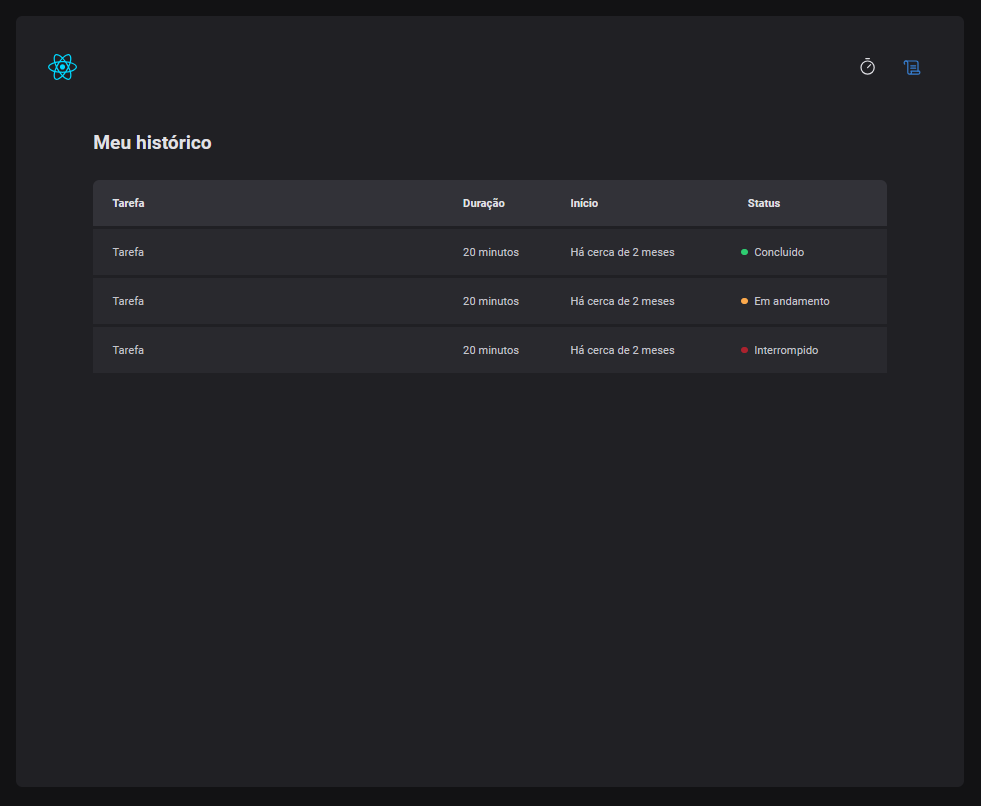

# POMODORO TIMER

O "POMODORO TIMER" é um aplicativo que ajuda você a gerenciar suas tarefas e tempos de trabalho. 

## Demonstração

### Home


### Lista de Tarefas



## Bibliotecas

- React
- Styled Components
- TypeScript
- Hooks
- Zod
- React Hook Form
- Date-fns

## Como executar

```bash
npm install
npm start
```